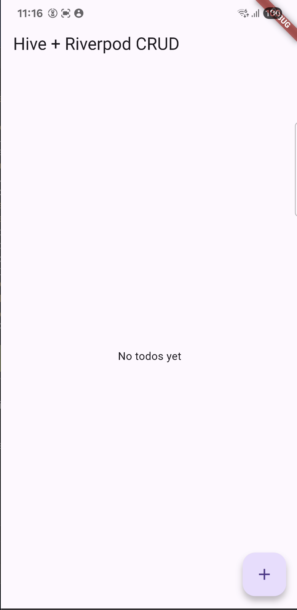
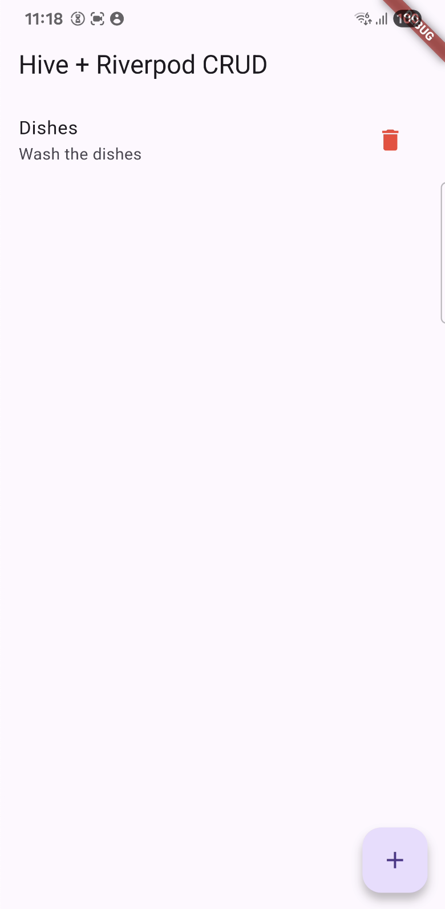

 # Hive + Riverpod CRUD Flutter App

A simple Flutter app demonstrating **persistent CRUD operations** using **Hive** for local storage and **Riverpod** for state management.

---

## **Features**

* Add, edit, and delete todos
* Persistent storage with Hive
* Reactive UI using Riverpod
* Clean project structure with models, repository, providers, and pages

---

## **Folder Structure**

```
lib/
├── main.dart
├── models/
│   ├── todo.dart
│   └── todo.g.dart
├── repositories/
│   └── todo_repository.dart
├── providers/
│   └── todo_provider.dart
└── pages/
    ├── home_page.dart
    └── todo_form_page.dart
```

* **models/** → Hive data models
* **repositories/** → Handles all data operations (CRUD)
* **providers/** → State management with Riverpod
* **pages/** → UI pages

---

## **Getting Started**

### **1. Prerequisites**

* Flutter SDK installed
* Dart SDK installed
* Android Studio or VS Code with Flutter extension

### **2. Clone the repository**

```bash
git clone https://github.com/marcus-exe/hive_app.git
cd hive_app
```

### **3. Install dependencies**

```bash
flutter pub get
```

### **4. Generate Hive Adapters**

```bash
flutter pub run build_runner build --delete-conflicting-outputs
```

> This generates the `todo.g.dart` file required for Hive.

### **5. Run the app**

```bash
flutter run
```

---

## **Packages Used**

* [Hive](https://pub.dev/packages/hive) → Lightweight NoSQL database for Flutter
* [Hive Flutter](https://pub.dev/packages/hive_flutter) → Hive integration for Flutter
* [Flutter Riverpod](https://pub.dev/packages/flutter_riverpod) → State management

---

## **Usage**

1. Tap the **+ button** to add a new todo
2. Tap on a todo to **edit**
3. Tap the **trash icon** to **delete**
4. Data is persisted locally and will remain after app restarts

---

## **Project Architecture**

* **Clean architecture**:

  * `Models` → Data representation
  * `Repositories` → Hive operations
  * `Providers` → State management (Riverpod)
  * `Pages` → UI components

* **Benefits**:

  * Separation of concerns
  * Easy to maintain and extend
  * Reactive updates with Riverpod

---

## **Screenshots**

Home | Add | List
:---:|:---:|:---:
 |  | 


---

## **Future Improvements**

* Add **search/filter** functionality
* Integrate with **remote backend**
* Add **authentication**
* Include **unit and widget tests**

---

## **License**

This project is open-source and available under the MIT License.
